# Entity-Relationship Diagram — InvoiceSaaS B2B Trading Platform

> All implemented entities as of Wave 20 (Supplier Invoicing / 3-Way Match)

```mermaid
erDiagram
    %% ─── Core Workspace & Auth ───────────────────────────────────────
    WORKSPACES {
        uuid id PK
        string name
        string slug
        string trn
        decimal default_tax_rate
        decimal credit_limit_default
        int credit_hold_days
    }

    USERS {
        uuid id PK
        uuid workspace_id FK
        string email
        string name
        string role
        bool is_active
    }

    WORKSPACES ||--o{ USERS : "has"

    %% ─── Sales & AR ──────────────────────────────────────────────────
    CLIENTS {
        uuid id PK
        uuid workspace_id FK
        string name
        string email
        string phone
        string tax_id
    }

    INVOICES {
        uuid id PK
        uuid workspace_id FK
        uuid client_id FK
        string invoice_number
        string status
        decimal subtotal
        decimal tax_amount
        decimal total_amount
        date issue_date
        date due_date
    }

    INVOICE_ITEMS {
        uuid id PK
        uuid invoice_id FK
        string description
        decimal quantity
        decimal unit_price
        decimal tax_rate
        decimal total_price
    }

    PAYMENTS {
        uuid id PK
        uuid invoice_id FK
        decimal amount
        string payment_method
        string status
        date payment_date
    }

    WORKSPACES ||--o{ CLIENTS : "owns"
    CLIENTS ||--o{ INVOICES : "billed_via"
    INVOICES ||--o{ INVOICE_ITEMS : "contains"
    INVOICES ||--o{ PAYMENTS : "receives"

    %% ─── Products ────────────────────────────────────────────────────
    CATEGORIES {
        uuid id PK
        uuid workspace_id FK
        string name
        uuid parent_id FK
    }

    BRANDS {
        uuid id PK
        uuid workspace_id FK
        string name
    }

    UNITS_OF_MEASURE {
        uuid id PK
        uuid workspace_id FK
        string code
        string name
    }

    PRODUCTS {
        uuid id PK
        uuid workspace_id FK
        string internal_sku
        string name
        uuid category_id FK
        uuid brand_id FK
        uuid base_uom_id FK
        decimal tax_rate
        decimal reorder_level
        bool is_active
    }

    WORKSPACES ||--o{ PRODUCTS : "owns"
    PRODUCTS }o--|| CATEGORIES : "in"
    PRODUCTS }o--|| BRANDS : "has"
    PRODUCTS }o--|| UNITS_OF_MEASURE : "measured_in"

    %% ─── Suppliers ───────────────────────────────────────────────────
    SUPPLIERS {
        uuid id PK
        uuid workspace_id FK
        string supplier_code
        string name
        string currency
        string payment_terms
        string status
    }

    WORKSPACES ||--o{ SUPPLIERS : "manages"

    %% ─── Inventory ───────────────────────────────────────────────────
    WAREHOUSES {
        uuid id PK
        uuid workspace_id FK
        string code
        string name
        bool is_active
    }

    WAREHOUSE_BINS {
        uuid id PK
        uuid warehouse_id FK
        string code
        bool is_active
    }

    INVENTORY_LEVELS {
        uuid id PK
        uuid workspace_id FK
        uuid product_id FK
        uuid warehouse_id FK
        uuid bin_id FK
        decimal on_hand
        decimal reserved
        decimal damaged
    }

    INVENTORY_TRANSACTIONS {
        uuid id PK
        uuid workspace_id FK
        uuid product_id FK
        string transaction_type
        decimal quantity
        uuid source_bin_id FK
        uuid destination_bin_id FK
        string reference_type
    }

    WAREHOUSES ||--o{ WAREHOUSE_BINS : "divided_into"
    PRODUCTS ||--o{ INVENTORY_LEVELS : "tracked_in"
    WAREHOUSES ||--o{ INVENTORY_LEVELS : "stores"
    WAREHOUSE_BINS ||--o{ INVENTORY_LEVELS : "at_bin"
    PRODUCTS ||--o{ INVENTORY_TRANSACTIONS : "tracks"

    %% ─── Procurement ─────────────────────────────────────────────────
    PROCUREMENT_REQUESTS {
        uuid id PK
        uuid workspace_id FK
        string request_number
        string status
        string source_type
        string destination_type
        string priority
        date required_by_date
    }

    PROCUREMENT_REQUEST_ITEMS {
        uuid id PK
        uuid request_id FK
        uuid product_id FK
        uuid uom_id FK
        decimal requested_quantity
        decimal approved_quantity
    }

    WORKSPACES ||--o{ PROCUREMENT_REQUESTS : "raises"
    PROCUREMENT_REQUESTS ||--o{ PROCUREMENT_REQUEST_ITEMS : "contains"

    %% ─── RFQ ─────────────────────────────────────────────────────────
    RFQS {
        uuid id PK
        uuid workspace_id FK
        string rfq_number
        string status
        string rfq_type
        datetime deadline
        string currency
    }

    RFQ_ITEMS {
        uuid id PK
        uuid rfq_id FK
        uuid product_id FK
        uuid uom_id FK
        decimal quantity
        decimal awarded_quantity
    }

    WORKSPACES ||--o{ RFQS : "creates"
    RFQS ||--o{ RFQ_ITEMS : "includes"

    %% ─── SPO ─────────────────────────────────────────────────────────
    SUPPLIER_PURCHASE_ORDERS {
        uuid id PK
        uuid workspace_id FK
        uuid supplier_id FK
        uuid warehouse_id FK
        string spo_number
        string status
        string currency
        decimal subtotal
        decimal vat_amount
        decimal total_amount
    }

    SUPPLIER_PURCHASE_ORDER_ITEMS {
        uuid id PK
        uuid spo_id FK
        uuid product_id FK
        uuid uom_id FK
        int line_number
        decimal quantity_ordered
        decimal unit_price
        decimal vat_rate
        decimal quantity_received
        decimal quantity_accepted
        decimal quantity_invoiced
    }

    SUPPLIERS ||--o{ SUPPLIER_PURCHASE_ORDERS : "fulfills"
    WAREHOUSES ||--o{ SUPPLIER_PURCHASE_ORDERS : "delivers_to"
    SUPPLIER_PURCHASE_ORDERS ||--o{ SUPPLIER_PURCHASE_ORDER_ITEMS : "has_lines"

    %% ─── GRN ─────────────────────────────────────────────────────────
    GOODS_RECEIPT_NOTES {
        uuid id PK
        uuid workspace_id FK
        uuid supplier_id FK
        uuid spo_id FK
        uuid warehouse_id FK
        string grn_number
        string status
        bool stock_posted
        date received_date
    }

    GRN_ITEMS {
        uuid id PK
        uuid grn_id FK
        uuid spo_item_id FK
        uuid product_id FK
        decimal quantity_received
        decimal quantity_accepted
        decimal quantity_damaged
        decimal quantity_rejected
        string damage_reason
        string rejection_reason
    }

    SUPPLIER_PURCHASE_ORDERS ||--o{ GOODS_RECEIPT_NOTES : "received_via"
    GOODS_RECEIPT_NOTES ||--o{ GRN_ITEMS : "contains"
    SUPPLIER_PURCHASE_ORDER_ITEMS ||--o{ GRN_ITEMS : "references"

    %% ─── Supplier Invoices (AP) ──────────────────────────────────────
    SUPPLIER_INVOICES {
        uuid id PK
        uuid workspace_id FK
        uuid supplier_id FK
        uuid primary_spo_id FK
        string supplier_invoice_number
        string status
        string three_way_match_status
        decimal subtotal
        decimal vat_amount
        decimal total_amount
        decimal amount_paid
        decimal balance_due
        string currency
    }

    SUPPLIER_INVOICE_ITEMS {
        uuid id PK
        uuid supplier_invoice_id FK
        uuid spo_item_id FK
        uuid grn_item_id FK
        uuid product_id FK
        decimal quantity
        decimal unit_price
        decimal vat_amount
        decimal total_price
        string match_status
        decimal variance_quantity
        decimal variance_price
        decimal variance_tax
    }

    SUPPLIERS ||--o{ SUPPLIER_INVOICES : "sends"
    SUPPLIER_PURCHASE_ORDERS ||--o{ SUPPLIER_INVOICES : "referenced_by"
    SUPPLIER_INVOICES ||--o{ SUPPLIER_INVOICE_ITEMS : "itemises"
    SUPPLIER_PURCHASE_ORDER_ITEMS ||--o{ SUPPLIER_INVOICE_ITEMS : "matched_to"
    GRN_ITEMS ||--o{ SUPPLIER_INVOICE_ITEMS : "confirmed_by"
```

## Key Relationships Summary

| Domain | Entities | Relationship |
|--------|----------|-------------|
| Sales AR | Client → Invoice → InvoiceItem | One client, many invoices, many items per invoice |
| Payments | Invoice → Payment | One invoice, many payment installments |
| Products | Workspace → Product → UoM/Category/Brand | Product master |
| Inventory | Product + Warehouse + Bin → InventoryLevel | Per-bin stock tracking |
| Procurement | PR → RFQ → SPO → GRN → SupplierInvoice | Full procure-to-pay chain |
| 3-Way Match | SPO Item ↔ GRN Item ↔ Invoice Item | Financial reconciliation |
